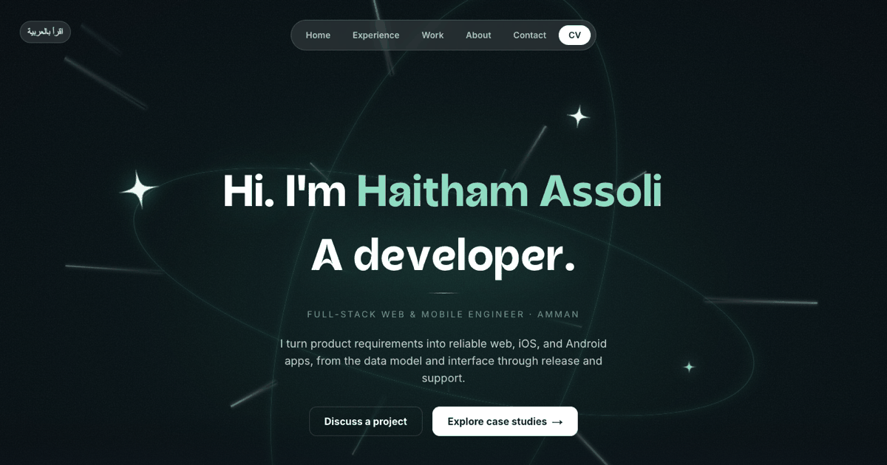

# Haitham Assoli — Portfolio

My portfolio for web and mobile work, with project case studies, experience, and a way to get in touch. Browse it in [English](https://assoli.site/en) or [Arabic](https://assoli.site/ar).



## Built with

Next.js 16, React 19, TypeScript, Tailwind CSS, and Motion. The site supports both left-to-right and right-to-left layouts, light and dark themes, and reduced-motion preferences.

## Run locally

```bash
npm ci
npm run dev
```

Open [http://localhost:3000/en](http://localhost:3000/en). For a production build, run `npm run build` followed by `npm run start`.

## Update the content

- Edit the bio and experience in [`src/content/profile.ts`](src/content/profile.ts).
- Edit project case studies in [`src/content/projects.ts`](src/content/projects.ts).
- Edit interface translations in [`src/libs/ui.ts`](src/libs/ui.ts).

## Contact

[Website](https://assoli.site) · [GitHub](https://github.com/haithamassoli) · [LinkedIn](https://www.linkedin.com/in/haithamassoli/) · [Email](mailto:haitham.b.assoli@gmail.com)
